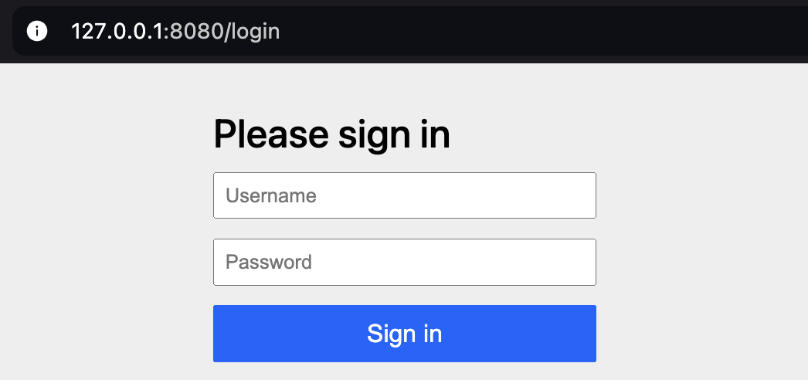

# OAuth2 Authentication Server with Spring Boot

## Key points
- It is in charge of authenticating users and delivers tokens that can be used to access various services.
- It acts as a centralized point of *authorization management*.
- It is typically used with one or more *resource servers* i.e. servers that holds protected resources.

*You can think of it as a **ticketing office** of an amusement park. A ticket has been bought on your name and lets you access various attractions for a certain period of time.*

## Setup
### Step 1: Installation
For Maven
```xml
<dependency>
    <groupId>org.springframework.boot</groupId>
    <artifactId>spring-boot-starter-oauth2-authorization-server</artifactId>
</dependency>
```
or using Gradle
```gradle
implementation "org.springframework.boot:spring-boot-starter-oauth2-authorization-server"
```

### Step 2: Configuration
We need to configure the following:


1. **RegisteredClientRepository** to manage *OAuth 2.0 clients* i.e. web or mobile apps that can request tokens. For each client we need:
- **Client ID and secret** to ensure requesters are legit.
- **Authentication method(s)** allowed for the client to authenticate using their ID & secret: *Basic* HTTP header, *JWT*, *POST* method, *TLS*, or none.

- **Grant type(s)** that are allowed for the client: authorization code, client credentials, refresh token, password (deprecated in OAuth 2.1), ...

- **Scope(s)**

2. **Login page location** for non-authenticated users to login.

3. **UserDetailsService** implementation that manages end-users credentials and roles.

4. **AuthorizationServerSettings** bean to configure the Spring authorization server.

Optionally, we can include:

1. **JWKSource** to sign access tokens.

2. **KeyPair** required by the `JWKSource` implementation.

3. **JwtDecoder** to decode signed access tokens.

We will create a configuration in the next step.


### Step 3: Implementation
We will use:
- **Authorization code** and **refresh token** as grant types.
- **Client secret post** as the client authentication method.

This is a common scenario for user authentication apps:
- The client redirects the user to the login page of the authorization server.
- The user authenticates with their credentials.
- The client obtains an authorization code, allow it to request an access token from the authorization server.

This approach is ideal for third-party authentication because the client doesn't handle the user credentials.

#### Create the authorization server configuration component

```java
@Configuration
public class AuthorizationServerConfig {

    /**
     * First security filter chain that applies OAuth 2.0 default security
     */
    @Bean
    @Order(1)
    public SecurityFilterChain authorizationServerSecurityFilterChain(HttpSecurity http) throws Exception {
        OAuth2AuthorizationServerConfiguration.applyDefaultSecurity(http);
        http.exceptionHandling((exceptions) -> exceptions
            .defaultAuthenticationEntryPointFor(
                    new LoginUrlAuthenticationEntryPoint("/login"),
                    new MediaTypeRequestMatcher(MediaType.TEXT_HTML)
            )
        );

        // Accept access tokens for User Info and/or Client Registration
        http.oauth2ResourceServer((resourceServer) -> {
            resourceServer.jwt(Customizer.withDefaults());
        });

        return http.build();
    }

    /**
     * Second security filter that is used to protect other endpoints
     */
    @Bean
    @Order(2)
    public SecurityFilterChain defaultSecurityFilterChain(HttpSecurity http) throws Exception {
        http.authorizeHttpRequests((authorize) -> {
            authorize.anyRequest().authenticated();
        });

        // Form login handles the redirect to the login page from the
        // authorization server filter chain
        http.formLogin(Customizer.withDefaults());
        return http.build();
    }

    /**
     * RegisteredClientRepository implementation, this is the central component for authorization servers.
     * Important:
     * - Externalize sensitive information before going in production
     * - InMemoryRegisteredClientRepository is best used for testing purposes only, use JdbcRegisteredClientRepository
     * for production.
     */
    @Bean
    public RegisteredClientRepository registeredClientRepository() {
        RegisteredClient registeredClient = RegisteredClient.withId("client")
                .clientId("client")
                .clientSecret("{noop}abcdef")
                .clientAuthenticationMethod(ClientAuthenticationMethod.CLIENT_SECRET_POST)
                .authorizationGrantType(AuthorizationGrantType.AUTHORIZATION_CODE)
                .authorizationGrantType(AuthorizationGrantType.REFRESH_TOKEN)
                .redirectUri("http://127.0.0.1:8080/login/oauth2/code")
                .scope("api.read")
                .build();

        return new InMemoryRegisteredClientRepository(registeredClient);
    }

    /**
     * Used to configure Spring Authorization Server
     */
    @Bean
    public AuthorizationServerSettings authorizationServerSettings() {
        return AuthorizationServerSettings.builder().build();
    }

    /**
     * A sample implementation of UserDetailsService using InMemoryUserDetailsManager.
     * We use in-memory user for simplicity, can be replaced with a database-based user service
     */
    @Bean
    public UserDetailsService userDetailsService() {
        UserDetails user = User.withDefaultPasswordEncoder()
                .username("user")
                .password("password")
                .roles("USER")
                .build();
        return new InMemoryUserDetailsManager(user);
    }
}
```

#### Authenticate as a user
Open a browser at the following URL
```
http://127.0.0.1:8080/oauth2/authorize?response_type=code&client_id=client&scope=api.read&redirect_uri=http://127.0.0.1:8080/login/oauth2/code
```
This URL indicates the following parameters:

- `response_type=code` indicates that we use the authorization code method.
- `client_id=client` indicates the client ID, as referenced in our `RegisteredClientRepository` implementation.
- `scope=api.read` is the requested scope, as referenced in our `RegisteredClientRepository` implementation.
- `redirect_uri=http://127.0.0.1:8080/login/oauth2/code` indicates the URL where the user will be redirected if they successfully authenticate.

You should see a screen similar to this one.



We can put our user credentials depending on the `UserDetailsService` implementation. In the example above, we just created an in-memory user `user/password`.

In a realistic scenario, the user should be brought to this page by the client. However, this documentation doesn't cover the client implementation.

#### Get the authorization code
After we authenticate successfully, we are redirected to the redirect URI as provided in `RegisteredClientRepository`.


Note that the authorization code has been provided in the `code` query parameter. We will use it to obtain the access token.

Since we haven't implemented the client code, the browser may display an error page, since the resource doesn't exist.

#### Obtain the access token
How we obtain the access token depends on how we have configured the allowed authentication method. For our case, we have choosen Client POST.

This means that we can obtain the token using a **POST** request.

```bash
curl -X POST http://127.0.0.1:8080/oauth2/token \
-H "Content-Type: application/x-www-form-urlencoded" \
-d "grant_type=authorization_code" \
-d "code=<OUR AUTHORIZATION CODE HERE>" \
-d "client_id=client" \
-d "client_secret=abcdef" \
-d "redirect_uri=http://127.0.0.1:8080/login/oauth2/code"
```

In our request, we have indicated the following parameters:
- `grant_type=authorization_code` is the grant type that we use to obtain the access token. In our case, we have the authorization code.
- `code=...` is the authorization code obtained from the previous step.
- `client_id=client` and `client_secret=abcdef` are the client ID and secret as referenced in `RegisteredClientRepository`. We certainly don't want unknown clients to obtain access tokens just because they have an authorization code.
- `redirect_uri=http://127.0.0.1:8080/login/oauth2/code` is the URI we obtained the authorization code from. **This must match with the `redirect_uri` parameter when authenticating the user.**

If everything went well, we should get a response similar to this one.

```json
{
    "access_token": "<SOME ACCESS TOKEN>",
    "refresh_token": "<SOME REFRESH TOKEN>",
    "scope": "api.read",
    "token_type": "Bearer",
    "expires_in": 299
}
```

Notice that the refresh token was provided so that we can use it to get another access token for that user.

#### Use the access token
Finally, we can use the access token to access various protected services.

```bash
curl -X GET http://localhost:8080/api/protected-resource \
-H "Authorization: Bearer <OUR_ACCESS_TOKEN>"
```

## Common issues

### 401 Unauthorized error
For example, when accessing the login page, you get a `401 Unauthorized` error. This is typically caused by your `SecurityFilterChain` implementation.

If you have any other `SecurityFilterChain` beans apart from the ones in the sample implementation, check that they don't have a higher precedence.

### invalid_grant

`{"error":"invalid_grant"}` when requesting a access token. 
- Check the `redirect_uri` and `grant_type` query parameters and make sure they match with a `RegisteredClientRepository` registered client.
- Make sure that the value of `redirect_uri` is the same as the one included in the login URL (before being redirected).
- Make sure you've not already used the authorization code, **it can only be used once**. You need to get another one otherwise.


### invalid_client

`{"error":"invalid_client"}` when requesting an access token.
- Make sure the `client_id` and `client_secret` parameters match with the credentials in the `RegisteredClientRepository` implementation.

